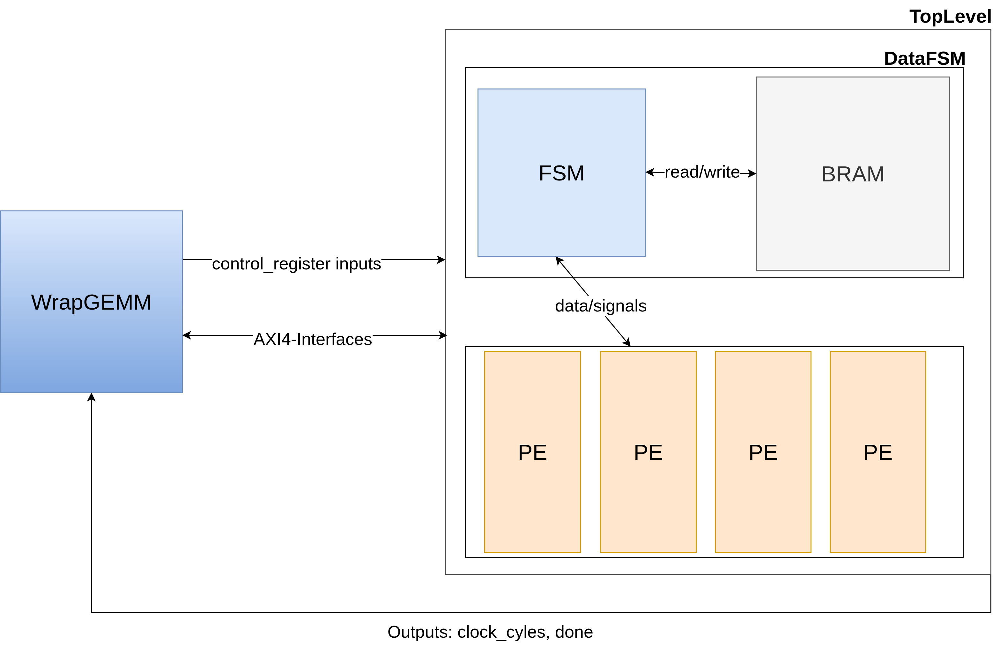

# An Accelerator for Ternary Language Models based on FPGA

Large Language Models contain billions of parameters, leading to high demands on computation, memory, and energy. These requirements pose significant challenges for edge deployment, where latency, power, and hardware resources are strictly constrained. Ternary quantization addresses these challenges by reducing weights to three discrete values {-1, 0, 1}, which decreases model size and enables efficient sparse matrix multiplication by replacing multiplications with simple additions and subtractions, thereby lowering memory usage and compute cost. Since CPUs and GPUs are not well optimized for arbitrary sparse matrix multiplication, this thesis/repository develops an FPGA-based accelerator for ternary sparse GEMM in LLM inference.

The accelerator is deployed on the Xilinx Alveo U55C platfrom using the [ETH Coyote](https://github.com/fpgasystems/Coyote) framework on the [Heterogenous Accelerated Compute Cluster HACC](https://systems.ethz.ch/research/data-processing-on-modern-hardware/hacc.html)

The following figure provides an overview of the accelerator design:


## Install Software

- [JDK 8](https://www.oracle.com/de/java/technologies/javase/javase8-archive-downloads.html)
- [sbt 1.11.4](https://www.scala-sbt.org/download) sbt will download [Scala 2.13.14](https://www.scala-lang.org/download/) and  [SpinalHDL 1.12.0](https://spinalhdl.github.io/SpinalDoc-RTD/master/SpinalHDL/Simulation/install/Verilator.html)
- Mill 0.11.13  (https://mill-build.org/mill/0.11.x/Java_Intro_to_Mill.html)
- [Verilator 5.034](https://www.veripool.org/verilator/)
- [GTK Wave](https://sourceforge.net/projects/gtkwave/)

## Compile and Run Simulation

For compiling the files:
~~~~
 mill gemmacc.compile
~~~~

For compiling and running simulation: 
~~~~
 mill gemmacc.runMain gemmacc.sim.ternaryGEMM.TopLevelSim
~~~~

`TopLevelSim` is a simulation that performs multiple ternary matrix calculations for different matrix sizes. The sizes can be modified by updating `val tests` with entries of the form (M, N, K).


## Generate HW-Code

⚠️ This step is **not required** if you use the provided pre-built bitstream  You can skip directly to [Deployment with Coyote](#deployment-with-coyote). 


On the file `hw/spinal/gemmacc/src/Generator` you can find all the objects, which generate the hdl code for the design.

With this command you can generate the hdl code for the ternaryGEMM design: 
~~~
 mill gemmacc.runMain gemmacc.src.TernaryGEMM
~~~~
it will be stored in `hw/gen/ternaryGEMM.v`

After generating the HDL, you must update the generated file to reflect the number of control registers used via `axi_ctrl`.

Locate and modify the following lines in the generated Verilog file `hw/gen/ternaryGEMM.v`:

```verilog
assign ctrlR_readAddressMasked  = (ctrlR_readDataStage_payload_addr & (64'h00000000000000FF));
assign ctrlR_writeAddressMasked = (io_axi_ctrl_aw_payload_addr &    (64'h00000000000000FF));
```
The mask `64'h00000000000000FF` defines how many address bits are used for accessing AXI control registers.
If you have more than 32 control registers, increase the mask accordingly with more `F`

## Deployment with Coyote

A pre-built bitstreaam for the U55C-platform is included in `coyote_files/hw/cyt_top.bit` to avoid long building times(**Build_HW , Create Folder Structure the hw part can be skipped**). However, instrcutions for building a new bitstream are included here as well:

### Book Server 
Get access to the https://systems.ethz.ch/research/data-processing-on-modern-hardware/hacc.html HACC server and book an alveo-u55c-0X server on https://hacc-booking.inf.ethz.ch/. 

### Clone Coyote Repository

Clone the Coyote repository and switch to the **tutorial** branch:
~~~
git clone --recurse-submodules https://github.com/fpgasystems/Coyote
cd Coyote
git switch tutorial
~~~~

### Create Folder Structure

Create folder structures:
~~~~
mkdir examples/11_perf_GEMM && cd examples/11_perf_GEMM 
mkdir hw && mkdir sw
~~~~

Create folders for hw:
~~~~
cd hw
mkdir src
cd src && mkdir hdl
~~~~

Place the generated Verilog file `ternaryGEMM.v` into  `Coyote/examples/11_perf_GEMM/hw/src/hdl`

Copy `vfpga_top.svh` (found in this repo under `coyote_files/hw`) into  `Coyote/examples/11_perf_GEMM/hw/src`

Finally, copy `CMakeLists.txt` from `coyote_files/hw` into  `Coyote/examples/11_perf_GEMM/hw`


Create folders for sw:
~~~~
cd sw
mkdir src
~~~~

Copy `CMakeLists.txt` from `coyote_files/sw` into  `Coyote/examples/11_perf_GEMM/sw`

Copy `main.cpp` from `sw/gemmacc` into `Coyote/examples/11_perf_GEMM/sw/src`


### Build HW

Create folder and set configuations using CMakeFile
~~~~
mkdir examples/11_perf_GEMM/hw/build_hw && cd examples/11_perf_GEMM/hw/build_hw
cmake ../ -DFDEV_NAME=u55c
~~~~

Create projects
~~~~
make project 
~~~~

After generating the project, copy the binary file  `hw/gen/ternaryGEMMOP.v_toplevel_TopLevel_dataFSM_1_Buffer_X.bin`  into  `Coyote/examples/11_perf_GEMM/hw/build_hw/perf_GEMM_config_0/user_c0_0/hdl/ext/raw`  

Then, open the project file  `Coyote/examples/11_perf_GEMM/hw/build_hw/perf_GEMM_config_0/user_c0_0/perf_GEMM.xpr` in Vivado and add the binary file to the project.


Generate and compile all bitstreams:

Starting tmux session

~~~~
tmux new -s build_hw
~~~~

then run compilation and generate bitstreams with 32 threads on this session and store output to `bitgen.log`

~~~~
make -j32 bitgen 2>&1 | tee bitgen.log
~~~~

Detaching from tmux
~~~~css
Ctrl+b then d
~~~~

Attaching to a session
~~~~
tmux attach -t build_hw
~~~~

This initial bitstream can be loaded via JTAG.

### Build SW

Before compiling the software you need to configure in the software `main.cpp`:

In `run_test` function you can enable debug informations and output verfication by uncomment the respective code segments.

In `main` you either run our evaluation benchmark with `run_benchmark(coyote_thread.get())` or you need to specify matrix-multiplication parameters `seq_len, hidden_size, intermediate_size, sparsity` and run it on the `run_test` function as `run_test(coyote_thread.get(), seq_len, intermediate_size, hidden_size, sparsity)`

Create folder, set configuations using CMakeFile and compile software files
~~~~
mkdir examples/11_perf_GEMM/sw/build_sw && cd examples/11_perf_GEMM/sw/build_sw
cmake ../
make
~~~~

Everytime you adjust the `main.cpp` you need to recompile: 

~~~~
cd examples/11_perf_GEMM/sw/build_sw
make
~~~~


### Build Driver

Be sure to compile the driver on the target deployment machine.
~~~
cd driver && make
~~~~

### Deployment on HACC

Loading Driver and programming FPGA on tutorial branch:

~~~
bash util/program_hacc_local.sh examples/11_perf_GEMM/hw/build_hw/bitstreams/cyt_top.bit driver/coyote_driver.ko 
~~~

if you have an ila configured, than you need to add the corresponding `cyt_top.ltx` on the Hardware Manager on Vivado


if output look like this :
~~~bash
ggiacone@alveo-u55c-08:~/Coyote bash util/program_hacc_local.sh examples/10_test_logic/hw/build_hw/bitstreams/cyt_top.bit driver/coyote_driver.ko 
***
** Programming the FPGA with examples/10_test_logic/hw/build_hw/bitstreams/cyt_top.bit
***
***
** FPGA programmed
***
 
***
** Inserting the driver from driver/coyote_driver.ko
***
** IP_ADDRESS: 0AFD4A60
** MAC_ADDRESS: 000A350B2608
***
** Driver loaded 
***
 
***
** It's Coyote after all, so thoughts & prayers!
** Lasciate ogni speranza, voi ch'entrate - Ihr, die ihr hier eintretet, lasst alle Hoffnung fahren
***

~~~
than contact the admins of HACC to get into the `vivado-developer` user group.

### Run

If the driver insertion and bitstream programming went correctly through. The system is read to run the software by simply executing:

~~~
cd Coyote/examples/11_perf_GEMM/sw/build_sw
bin/test
~~~
